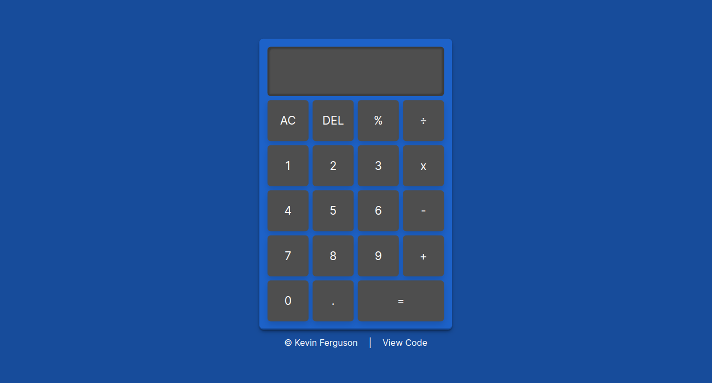

# Calculator

:point_right: [Click Here to View the Live Demo](https://glonky1337.github.io/calculator/index.html) :point_left:

Basic calculator built from scratch without a tutorial.

## Key Concepts Employed

### HTML:
- Semantic HTML: The HTML code uses semantic tags to describe the content of the website, such as "header", "section", "main", and "footer".
- Linking external files: The HTML code uses the "link" tag to link external CSS and JavaScript files to the webpage.
- Deferring script execution: The HTML code uses the "defer" attribute in the script tag to defer script execution until after the page has finished parsing.

### CSS:
- Box model: The layout of individual elements on the page is determined by the CSS box model, which includes properties like "padding", "border", and "margin".
- Flexbox layout: The layout of the website is created using the "display: grid" property, which allows for a flexible and responsive layout that adapts to different screen sizes.
- Styling buttons: The CSS code styles the buttons on the calculator, including hover and active states, using various CSS properties like "background-color", "transform", "box-shadow", and "transition".

### JavaScript:
- DOM manipulation: The JavaScript code uses the Document Object Model (DOM) to manipulate the elements on the page in response to user interaction.
- Event listeners: The JavaScript code adds an event listener to the calculator container to detect when a button is clicked, and then calls a function to execute the appropriate action.
- Conditional statements: The JavaScript code uses if-else statements to determine whether the user is entering the first or second operand of a calculation and to decide what action to take based on the button clicked.
- Flag variables: The JavaScript code uses a flag variable to keep track of whether a decimal point has already been added to a number.
- Functions: The JavaScript code uses various functions to handle different operations, including assigning variables, updating the display, evaluating expressions, clearing the display, deleting values, and performing mathematical operations (addition, subtraction, multiplication, and division).
- Array manipulation: The JavaScript code uses arrays to store the variables entered by the user and to manipulate them during calculations.
- Error handling: The JavaScript code handles the error of dividing by zero by displaying a message on the calculator display.
- Type coercion: The JavaScript code uses type coercion to convert the arrays of digits into numbers for mathematical operations.
